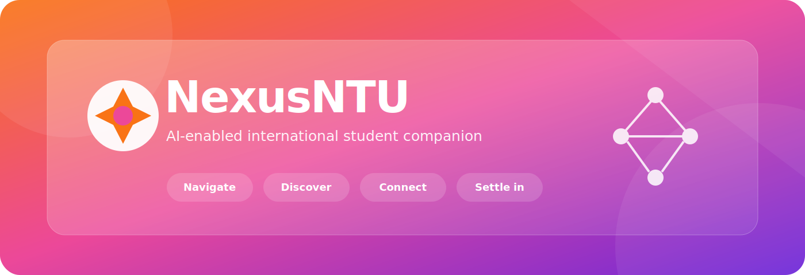
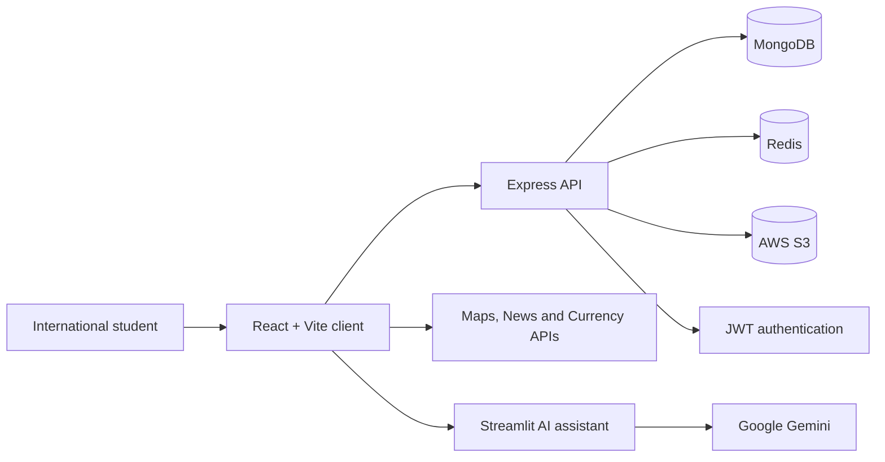

<div align="center">
  

  <br />

  [](https://react.dev/)
  [](https://nodejs.org/)
  [](https://expressjs.com/)
  [](https://www.mongodb.com/)
  [](https://ai.google.dev/)
  [](https://github.com/aish-1509/NexusNTU/actions/workflows/ci.yml)
  [](#project-status)

  **One digital home for navigating, understanding, and settling into life at NTU.**
</div>

## Overview

NexusNTU is a full-stack student companion designed to reduce the fragmented
onboarding experience faced by international students at Nanyang Technological
University. It brings campus navigation, nearby amenities, practical tools,
personalized information, university links, and an AI guide into one responsive
experience.

The project was delivered by **Team CtrlAltElite** for **SC3040 Advanced
Software Engineering** at NTU.

> **Project leadership:** Aishwarya Anand served as Project Manager and Team
> Lead for the six-person team, coordinating the work from problem framing and
> requirements through planning, delivery governance, risk, release, testing,
> demonstration, and final submission.

[Read the portfolio case study](docs/PROJECT_CASE_STUDY.md) |
[Explore the project evidence](docs/README.md) |
[View the final presentation](docs/06-demo/final-presentation.pdf)

## The Problem

New international students often have to move between disconnected university
pages, map services, news sources, support channels, and external utilities
while adapting to a new country and campus. That creates avoidable friction at
exactly the point when clear, trusted guidance matters most.

NexusNTU turns that fragmented journey into a single product surface:

| Student need | NexusNTU capability |
| --- | --- |
| Understand where to go | Route planning and Google Maps-powered navigation |
| Find essentials nearby | Search for transport, food, healthcare, shops, and other amenities |
| Get practical local help | Gemini-powered conversational and image-aware assistant |
| Manage day-to-day finances | Currency conversion personalized by nationality |
| Stay informed | Configurable local, world, and home-country news |
| Reach university systems quickly | Curated NTU academic, support, finance, and career links |
| Maintain a personal experience | Registration, authentication, profile, avatar, and settings flows |

## Product Highlights

- **AI student guide:** A Streamlit assistant powered by Google Gemini for
  conversational questions and multimodal image prompts.
- **Campus discovery:** Navigation and nearby-place exploration using Google
  Maps and Places.
- **Personalized dashboard:** A responsive command center for the product's
  core services.
- **Identity and profiles:** JWT authentication, password management, profile
  editing, avatar storage, and phone-based flows.
- **Faster profile access:** Redis-backed caching over MongoDB profile data.
- **Operational completeness:** Requirements, backlog, quality, risk, change,
  release, configuration, and testing artifacts are included as project
  evidence.

## Architecture



| Layer | Technologies | Responsibility |
| --- | --- | --- |
| Web client | React, Vite, Tailwind CSS, Axios | Responsive workflows and service integrations |
| API | Node.js, Express | Authentication, profiles, avatars, and application endpoints |
| AI assistant | Python, Streamlit, Gemini | Conversational and multimodal support |
| Data | MongoDB, Mongoose | User and avatar persistence |
| Performance | Redis | Profile caching and cache invalidation |
| Storage | AWS S3 | User avatar object storage |

## Leadership And Delivery

This repository is intentionally more than source code. It shows how the
product was managed end to end.

**Aishwarya Anand's leadership scope**

- Led a six-person team and chaired recurring planning and delivery reviews.
- Drove problem definition, feature scope, requirements, use cases, and backlog
  organization.
- Coordinated milestone plans, GitHub submissions, demos, and the final
  presentation.
- Maintained visibility over quality, risk, change, configuration, release,
  and testing workstreams.
- Contributed to product implementation and the final NexusNTU redesign while
  keeping the complete system integrated.

This was a collaborative team project. The repository credits the team outcome
without presenting shared work as a solo build.

## Repository Structure

```text
.
├── ai-assistant/       # Streamlit + Gemini conversational assistant
├── client/             # React/Vite web application
├── server/             # Express API, MongoDB models, Redis, and S3 flows
├── docs/               # Product, planning, quality, design, test, and demo evidence
├── SECURITY.md         # Credential and vulnerability guidance
└── package.json        # Convenient monorepo commands
```

## Quick Start

### Prerequisites

- Node.js 22.12+
- Python 3.10+
- MongoDB
- Redis
- API credentials for the integrations you want to exercise

### 1. Install JavaScript dependencies

```bash
npm run install:all
```

### 2. Configure local environments

```bash
cp server/.env.example server/.env
cp client/.env.example client/.env
cp ai-assistant/.env.example ai-assistant/.env
```

Populate the copied files with your own credentials. Never commit populated
`.env` files.

### 3. Start the API

```bash
npm run dev:server
```

The API runs at `http://localhost:3000`. Its health endpoint is
`http://localhost:3000/health`.

### 4. Start the web client

```bash
npm run dev:client
```

Open `http://localhost:5173`.

### 5. Start the AI assistant

```bash
cd ai-assistant
python -m venv .venv
source .venv/bin/activate
pip install -r requirements.txt
streamlit run app.py
```

The dashboard expects the assistant at `http://localhost:8501` by default.

## Configuration

| Area | Variables |
| --- | --- |
| Server | `MONGO_URI`, `JWT_SECRET`, `REDIS_URL`, `CLIENT_ORIGIN`, AWS credentials and bucket |
| Client | News API, RapidAPI, Google Maps, Firebase, AI assistant URL, API proxy target |
| AI assistant | `GEMINI_API_KEY` |

Browser-side credentials should be restricted by allowed domain, permitted API,
and quota in the provider console.

## Project Status

NexusNTU is an **academic prototype**, not a production service. It was
evaluated through planned test cases, coverage work, demonstrations, and a
final presentation. The repository does not claim production deployment or
real-user adoption metrics that were not measured.

The included evidence covers:

- system requirements and use cases
- project plan and product backlog
- quality and risk management
- maintainability, change, configuration, and release planning
- test plan, test cases, and coverage
- demo and final presentation

## Validation

```bash
npm run build
npm run lint
node --check server/app.js
python -m compileall ai-assistant
```

## Attribution

Prepared by **Team CtrlAltElite** at Nanyang Technological University for
**SC3040 Advanced Software Engineering**. Aishwarya Anand was the team's
Project Manager and Team Lead.

The repository is public as a portfolio and educational artifact. No
open-source license is granted.
